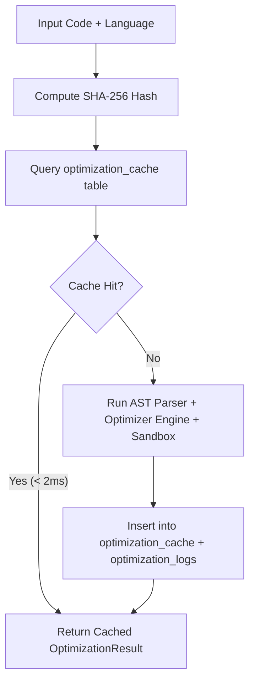

# Agents and Skills

This repository incorporates custom AI coding agents and reusable skills specifically built for the **OptiCode** platform. These assets extend developer capabilities, automate complexity analysis, enforce architecture rules, and optimize database caching.

---

## Custom Agent

### Name
**OptiCode Optimization Agent**

### Location
[`.agents/agents/opticode-optimization-agent.md`](file:///c:/Users/KIIT/Desktop/CODING/Projects/project_gdg/.agents/agents/opticode-optimization-agent.md)  
Client Implementation: [`src/utils/optiCodeAgent.js`](file:///c:/Users/KIIT/Desktop/CODING/Projects/project_gdg/src/utils/optiCodeAgent.js)

### Purpose
The OptiCode Optimization Agent is a dedicated 6-step AI agent engine that reads raw source code across JavaScript, Python, C++, Java, and Rust, performs semantic and structural pattern detection, classifies algorithmic bottlenecks ($O(n^2)$, $O(n^3)$, $O(2^n)$, $O(n)$ linear scans), and produces language-idiomatic, fully refactored source code targeting $O(n)$ or $O(\log n)$ time complexity.

### Responsibilities
1. **READ**: Parse the submitted source code structure — extracting functions, parameters, variables, loop nesting depth, and imports.
2. **ANALYZE**: Detect anti-patterns (nested loops, un-memoized recursion, string concatenation inside loops, linear search in loops, manual bubble sort, linear primality).
3. **CLASSIFY**: Determine whether code is already optimal (`alreadyOptimal: true`) to avoid redundant processing.
4. **PLAN**: Select the appropriate language-specific refactoring strategy (HashMap lookup, memoization, StringBuilder/stringstream, Set conversion, TimSort, sqrt primality).
5. **TRANSFORM**: Generate real, syntactically valid transformed code preserving the user's function signatures and variable naming.
6. **MEASURE**: Calculate before/after time complexity, space complexity, execution time (ms), and speedup ratio.

### How to Use It
The agent is integrated directly into the OptiCode IDE UI:
1. Open or select any source file in the File Explorer (e.g. `example.py`, `datagrid.js`, `quick_sort.cpp`).
2. Click the glowing red **OPTIMIZE CODE** button in the editor header.
3. The agent executes the 6-step pipeline asynchronously.
4. If optimization is possible, the refactored code appears in the right pane with updated metrics; if already optimal, the "Max Optimization Achieved" toast is displayed.

Programmatic invocation:
```javascript
import { runOptiCodeAgent } from './src/utils/optiCodeAgent';

const result = await runOptiCodeAgent(sourceCode, 'python', 'example.py');
if (result.alreadyOptimal) {
  console.log("Code is already optimal!");
} else {
  console.log("Optimized code:", result.optimizedCode);
  console.log("Speedup:", result.timeEfficiencyGain);
}
```

### Example Use Cases
- **Python Two Sum ($O(n^2) \to O(n)$)**: Transforms nested `for i in range(len(arr)): for j in range(i+1, len(arr)):` into a single-pass `seen = {}` dictionary complement lookup.
- **JavaScript String Concatenation ($O(n^2) \to O(n)$)**: Converts repeated `str += items[i]` inside loops to an array buffer `_buf.push()` with a final `_buf.join('')`.
- **Python Fibonacci Recursion ($O(2^n) \to O(n)$)**: Injects `@lru_cache(maxsize=None)` directly above the recursive function definition.
- **C++ Vector Reallocation**: Injects `.reserve()` before `.push_back()` loops to prevent repeated heap allocations.

---

## Custom Skill

### Name
**OptiCode Cache Optimizer Skill** (`opticode-cache-optimizer`)

### Location
[`.agents/skills/opticode-cache-optimizer/SKILL.md`](file:///c:/Users/KIIT/Desktop/CODING/Projects/project_gdg/.agents/skills/opticode-cache-optimizer/SKILL.md)

### Purpose
The OptiCode Cache Optimizer skill provides fast SHA-256 code hashing, checks the SQLite `OptimizationCache` table, and bypasses heavy AST parsing and Docker sandbox execution whenever identical code snippets are re-submitted.

### How to Invoke / Use It
The skill is invoked automatically at the beginning of the backend optimization pipeline:
1. When a code snippet is submitted to `POST /api/v1/optimize`, the skill generates a canonical hash:
   $$\text{code\_hash} = \text{SHA-256}(\text{language} + \text{":"} + \text{code.strip()})$$
2. The skill executes an indexed $O(1)$ query on `optimization_cache`.
3. If a match exists (Cache HIT), it returns the cached `OptimizationResult` in under $2\text{ms}$.
4. If a miss occurs (Cache MISS), the full AST sandbox pipeline runs, and the result is saved to the cache for subsequent requests.

### Workflow


### Example Use Cases
- **Repeated Optimization Requests**: When a developer re-optimizes an unchanged file after switching tabs, the response is delivered instantly from SQLite cache without invoking AST or Docker.
- **Benchmark Suite Pre-warming**: Standard benchmark snippets (e.g. `quick_sort.cpp`, `matrixalgo.java`) are cached after their initial run, providing sub-millisecond responses for demos and tests.
- **Historical Audit Trail**: Every cached execution creates a timestamped record in `optimization_logs` for telemetry and analytics.

---

## Integration with AI Development Workflow

These agents and skills integrate seamlessly with the project's development lifecycle:

1. **Constitution Compliance ([`AGENTS.md`](file:///c:/Users/KIIT/Desktop/CODING/Projects/project_gdg/AGENTS.md))**: Every AI coding agent working in this repository follows the strict rules in `AGENTS.md` (no Redux, no TailwindCSS, parameterized SQLite queries, per-file isolation).
2. **Automated Testing**: Any modifications to agent logic are verified with `node test_agent_logic.js` (6 pattern tests) and `python test_multi_language_programs.py` (17 language tests).
3. **CI/CD Pipeline**: The GitHub Actions workflow (`.github/workflows/ci.yml`) executes both the agent test suite and the backend pytest suite on every push.
