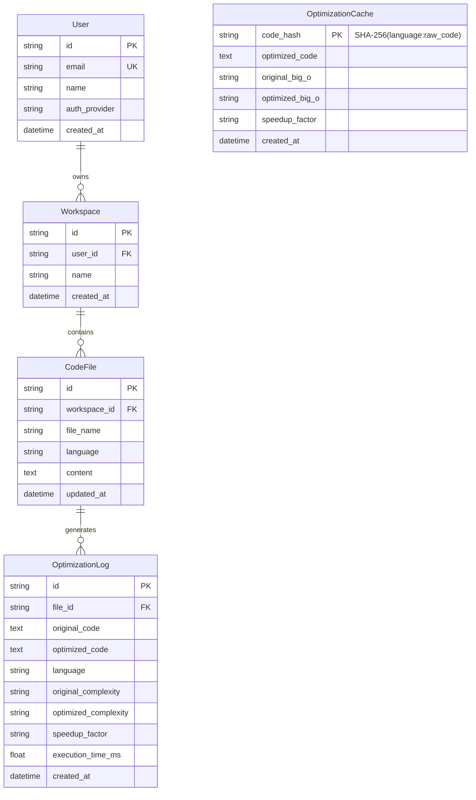

# OptiCode System Architecture & Technical Design Document

## 1. System Overview & Technology Stack

**OptiCode** is an AI-powered multi-language Code Optimization IDE & Performance Analysis platform. It analyzes source code across C++, Python, JavaScript, Java, and Rust to detect algorithmic complexity bottlenecks (e.g. $O(n^2)$ nested loops, $O(2^n)$ un-memoized recursion, string concatenation memory overhead) and refactors them into optimal linear $O(n)$ or logarithmic $O(\log n)$ algorithms.

### Tech Stack
- **Frontend**: React 18, Vite, TailwindCSS / Vanilla CSS, Lucide Icons
- **Backend API**: Python 3.11+, FastAPI, Uvicorn, Pydantic v2
- **Database Layer**: PostgreSQL 16 (Production) / SQLite (Development Fallback), Prisma ORM
- **AST Parsing Engine**: Tree-Sitter, Python AST
- **Execution Sandbox**: Docker SDK with resource isolation (`network_mode="none"`, 128MB RAM cap, 1.0 CPU quota)

---

## 2. High-Level Architecture Diagram

```
+-------------------------------------------------------+
|                OptiCode React IDE Frontend            |
|                  (Vite - Port 5173/3000)              |
+---------------------------+---------------------------+
                            |
                     HTTP / REST API
                            |
v                           v
+-------------------------------------------------------+
|                  FastAPI Backend Gateway              |
|                      (Port 8000)                      |
+---------------------------+---------------------------+
                            |
           +----------------+----------------+
           |                                 |
           v                                 v
+-----------------------+         +-----------------------+
|  OptimizationCache    |         | 5-Stage AST Sandbox   |
|  SHA-256 Lookup       |         | Pipeline              |
+----------+------------+         +----------+------------+
           |                                 |
           | CACHE HIT                       | CACHE MISS
           v                                 v
+-----------------------+         +-----------------------+
| Instant Response      |         | AST Analysis & Engine |
| (< 2ms Latency)       |         | Refactoring           |
+-----------------------+         +----------+------------+
                                             |
                                             v
                                  +-----------------------+
                                  | Persist Cache & Log   |
                                  +----------+------------+
                                             |
                                             v
                                  +-----------------------+
                                  | PostgreSQL / SQLite   |
                                  | Database Layer        |
                                  +-----------------------+
```

---

## 3. Relational Data Models

The database layer manages 5 relational tables:



---

## 4. Security & Sandbox Constraints

1. **Network Isolation**: Docker sandbox containers run with `network_mode="none"`.
2. **Resource Boundaries**: Strict 128MB memory cap and 1.0 CPU quota limit execution.
3. **SQL Injection Prevention**: All queries use parameterized statements (`cursor.execute(sql, params)`).
4. **Payload Caps**: Max incoming code length capped at 20,000 characters.
