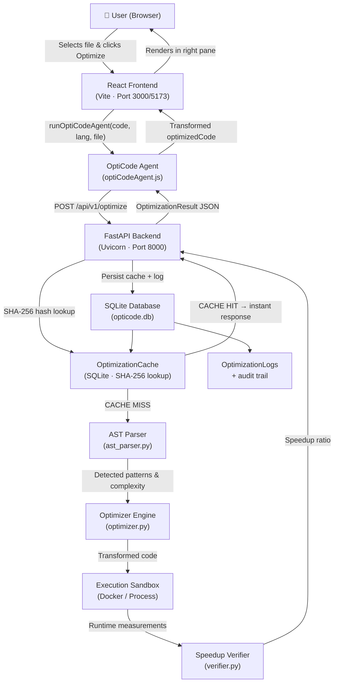
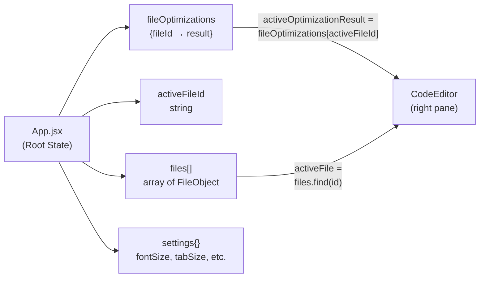
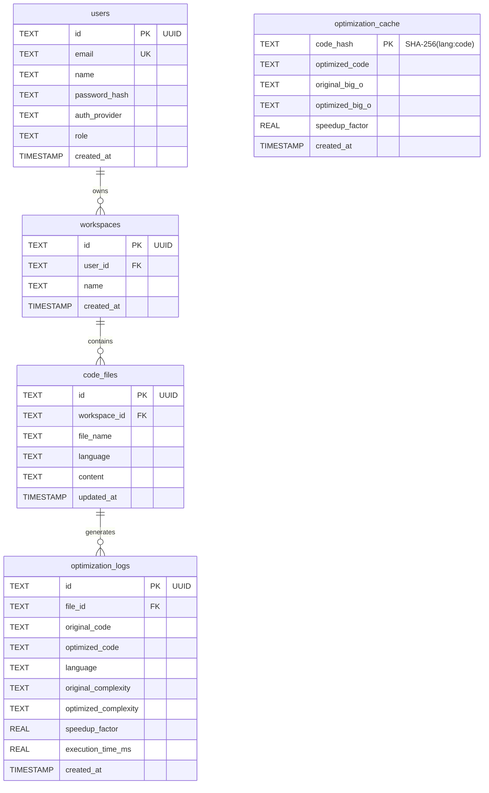
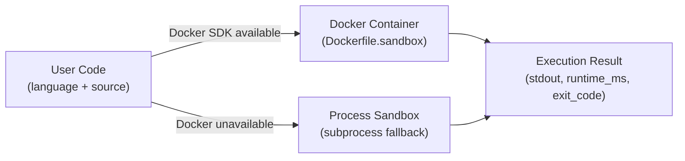
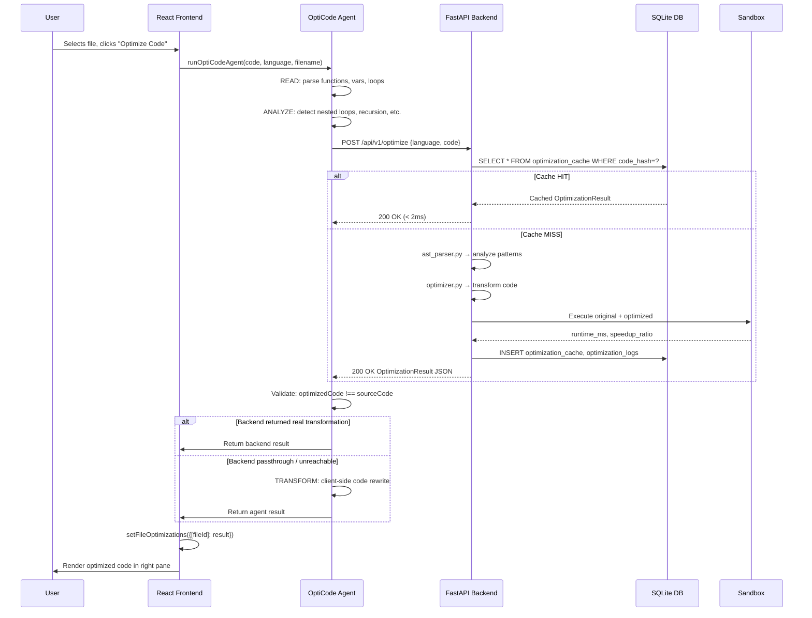

# OptiCode — System Architecture & Technical Design

> **Last Updated:** August 2026 | Reflects the actual production implementation.

---

## 1. System Overview

**OptiCode** is an AI-powered, multi-language Code Optimization IDE and Performance Analysis platform. Users select source files inside an interactive dual-pane web IDE, click **Optimize Code**, and the OptiCode Agent pipeline reads the actual code, detects algorithmic bottlenecks (e.g. O(n²) nested loops, O(2ⁿ) unguarded recursion, O(n²) string concatenation), and produces a fully-rewritten, language-idiomatic optimized version in the right pane.

**Supported languages:** JavaScript · Python · C++ · Java · Rust

---

## 2. Technology Stack

| Layer | Technology | Version |
|---|---|---|
| **Frontend Framework** | React | 18.2 |
| **Build Tool** | Vite | 5.x |
| **Styling** | Vanilla CSS (custom design system) | — |
| **Icon Library** | Lucide React | 0.344 |
| **Backend Framework** | FastAPI | ≥ 0.100 |
| **ASGI Server** | Uvicorn | ≥ 0.22 |
| **Data Validation** | Pydantic v2 | ≥ 2.0 |
| **Database** | SQLite (via Python `sqlite3`) | 3.x |
| **AST Parsing** | Python `ast` (stdlib) + tree-sitter | ≥ 0.21 |
| **Execution Sandbox** | Docker SDK + process-level fallback | ≥ 6.1 |
| **HTTP Client (tests)** | httpx + FastAPI TestClient | ≥ 0.24 |
| **Test Framework** | pytest | ≥ 7.4 |
| **Runtime** | Node.js 20 LTS / Python 3.11+ | — |

> **Note:** No Prisma ORM, no PostgreSQL, no TailwindCSS — the application uses vanilla SQLite via Python `sqlite3` and vanilla CSS.

---

## 3. Repository Structure

```
project_gdg/
├── app/                          # FastAPI backend
│   ├── main.py                   # Application entry point, CORS, startup
│   ├── config.py                 # Pydantic settings model
│   ├── db.py                     # SQLite schema, init_db(), CRUD helpers
│   ├── api/
│   │   ├── routes.py             # All API route handlers
│   │   └── schemas.py            # Pydantic request/response models
│   └── services/
│       ├── ast_parser.py         # AST analysis engine (5 languages)
│       ├── optimizer.py          # Code transformation engine
│       ├── sandbox.py            # Docker + process execution sandbox
│       └── verifier.py           # Before/after speedup verification
│
├── src/                          # React frontend (Vite)
│   ├── App.jsx                   # Root component, state, optimization orchestration
│   ├── main.jsx                  # React DOM entry
│   ├── app-custom.css            # Global design system & component styles
│   ├── components/
│   │   ├── CodeEditor.jsx        # Dual-pane editor (source + optimized)
│   │   ├── FileExplorer.jsx      # File/folder tree panel
│   │   ├── Navbar.jsx            # Top navigation bar
│   │   ├── Sidebar.jsx           # Activity bar (icons)
│   │   ├── TerminalPanel.jsx     # Bottom terminal / optimization logs
│   │   ├── UserDashboard.jsx     # Analytics dashboard
│   │   ├── AuthModal.jsx         # Login/register modal with rate limiting
│   │   ├── SettingsModal.jsx     # Font, theme, tab settings
│   │   ├── LegalModal.jsx        # Terms of Use / Privacy Policy
│   │   └── SearchPanel.jsx       # File search panel
│   ├── data/
│   │   └── defaultFiles.js       # 12 built-in benchmark programs (5 languages)
│   └── utils/
│       ├── optiCodeAgent.js      # 6-step optimization agent (main engine)
│       └── optimizerEngine.js    # Legacy fallback + preset optimizer
│
├── tests/
│   └── test_api.py               # FastAPI integration tests (15 routes)
├── test_db_integration.py        # SQLite schema & CRUD tests
├── test_multi_language_programs.py  # 17 multi-language optimization tests
├── test_pipeline.py              # End-to-end optimization pipeline tests
│
├── .agents/
│   ├── agents/
│   │   ├── database-architect-agent.json   # DB schema agent definition
│   │   └── opticode-optimization-agent.md  # OptiCode Agent (main)
│   └── skills/
│       └── opticode-cache-optimizer/
│           └── SKILL.md          # SHA-256 cache lookup skill
│
├── .github/
│   └── workflows/
│       └── ci.yml                # GitHub Actions CI pipeline
│
├── ARCHITECTURE.md               # This document
├── AGENTS.md                     # Agent rules & constitution
├── AGENTS_AND_SKILLS.md          # Agent & skill documentation
├── README.md                     # Quick start guide
├── requirements.txt              # Python dependencies
├── package.json                  # Node.js dependencies & scripts
├── vite.config.js                # Vite build configuration
├── Dockerfile                    # Production Docker image
├── Dockerfile.sandbox            # Isolated code execution sandbox image
├── docker-compose.yml            # Multi-container orchestration
└── .env.example                  # Environment variable template
```

---

## 4. High-Level Architecture



---

## 5. Frontend Architecture

### State Management

All application state lives in `App.jsx` (React `useState`). There is no external state manager (no Redux, no Zustand).



### Key Design Decisions

| Decision | Rationale |
|---|---|
| `key={activeFileId}` on `<CodeEditor>` | Forces full React remount on file switch — guarantees zero stale state between files |
| `fileOptimizations[fileId]` map | Per-file isolation: switching files switches optimization result; editing a file clears its stale result |
| `handleUpdateFileContent` deletes stale cache | Any edit to source code resets the optimization pane to blank |
| `alreadyOptimal` path | Returns `{alreadyOptimal: true}` — shows "Max Optimization Achieved" toast, stores nothing |

### Component Responsibilities

| Component | Role |
|---|---|
| `CodeEditor.jsx` | Dual-pane editor; left = editable source textarea; right = read-only optimized `<pre>` |
| `FileExplorer.jsx` | File/folder tree with create, delete, rename, drag-to-folder |
| `TerminalPanel.jsx` | Collapsible bottom panel showing optimization logs from the agent |
| `UserDashboard.jsx` | Real-time workspace analytics: bottleneck scan, history, JSON audit export |
| `AuthModal.jsx` | Login/register with rate-limiting (5 attempts / 15 min window) |
| `SettingsModal.jsx` | Font size (12–20px), tab size (2/4 spaces), theme, auto-format toggles |

---

## 6. Backend / API Architecture

### OptiCode Agent Pipeline (Frontend — `optiCodeAgent.js`)

The primary optimization pipeline runs **in the browser** as a 6-step agent:

```
Step 1: READ      — Parse source code: extract functions, variables, loop structure, imports
Step 2: ANALYZE   — Detect anti-patterns (nested loops, recursion, string concat, etc.)
Step 3: CLASSIFY  — Determine alreadyOptimal or issue list with severity
Step 4: PLAN      — Select transformation strategy per language + issue type
Step 5: TRANSFORM — Apply actual code rewrites (not comment hints)
Step 6: MEASURE   — Estimate before/after timing and speedup ratio
```

The agent first **tries the FastAPI backend** for deep analysis. If the backend returns a genuinely different optimized code, that is used. Otherwise, the client-side transformation engine is applied.

### FastAPI Backend Routes (`app/api/routes.py`)

| Method | Path | Description |
|---|---|---|
| `GET` | `/api/v1/health` | Health check |
| `POST` | `/api/v1/optimize` | Main optimization endpoint |
| `POST` | `/api/v1/optimize/batch` | Batch optimization (1–10 snippets) |
| `POST` | `/api/v1/register` | User registration |
| `POST` | `/api/v1/login` | User authentication |
| `GET` | `/api/v1/workspace` | List user workspaces |
| `POST` | `/api/v1/workspace` | Create workspace |
| `GET` | `/api/v1/workspace/{id}/files` | List workspace files |
| `GET` | `/api/v1/analytics/history` | Optimization history |

### Backend Optimization Pipeline (Python — `app/services/`)

```
Request → SHA-256 cache check (db.py)
         ↓ CACHE MISS
         ast_parser.py → detect patterns, measure loop depth, complexity
         ↓
         optimizer.py → language-specific code transformation
         ↓
         sandbox.py → execute original + optimized code (Docker or process)
         ↓
         verifier.py → compute speedup ratio, measure runtime
         ↓
         Persist to OptimizationCache + OptimizationLogs
         ↓
         Return OptimizationResult JSON
```

---

## 7. Database / Data Model

The database is **SQLite** (`app/opticode.db`), initialized on startup via `app/db.py`.



### Cache Strategy

Before running the full AST → optimize → sandbox pipeline, the backend computes:
```python
code_hash = SHA-256(f"{language.lower()}:{code.strip()}")
```
and queries `optimization_cache` by primary key — O(1) indexed lookup, returning cached results in < 2 ms.

---

## 8. Authentication & Authorization

- **Registration/Login**: `POST /api/v1/register` and `POST /api/v1/login`
- **Password Storage**: Passwords are hashed before storage (via `utils/security.py`)
- **Rate Limiting**: `app/utils/rate_limiter.py` enforces 5 attempts per 15-minute window per IP. Headers `X-RateLimit-Limit`, `X-RateLimit-Remaining`, `X-RateLimit-Reset`, `Retry-After` are returned.
- **Frontend Auth**: `AuthModal.jsx` mirrors the rate limiting logic for immediate UX feedback (lockout countdown timer).
- **Session**: Client-side only (`localStorage`). No JWT or server-side sessions in the current implementation.

---

## 9. External Services

OptiCode is designed to run self-contained without mandatory cloud dependencies:

| Service / Dependency | Type | Integration Point | Purpose |
|---|---|---|---|
| **Docker Engine** | Local Container Runtime | `app/services/sandbox.py` | Isolated code execution sandbox (`bigo-sandbox:latest`) |
| **Tree-Sitter Languages** | Local Parsing Grammar | `app/services/ast_parser.py` | Multi-language AST parsing for C++, Java, JS, Rust, Python |
| **Uvicorn / FastAPI** | Local ASGI Server | `app/main.py` | High-performance async REST API on port 8000 |
| **SQLite stdlib** | Local Database Engine | `app/db.py` | Embedded relational persistence with zero external infrastructure |
| **GitHub Actions** | CI/CD Automation | `.github/workflows/ci.yml` | Automated build, test, and lint validation on push/PR |

---

## 9.1. Execution Sandbox Architecture



**Constraints enforced:**
- `network_mode="none"` — no outbound network access
- Memory limit: `128MB`
- CPU quota: `1.0` core
- Timeout: `5 seconds`
- Max code length: `20,000 characters`

---

## 10. Data Flow — Complete Optimization Request



---

## 11. Security Considerations

| Area | Measure |
|---|---|
| SQL Injection | All queries use parameterized `cursor.execute(sql, params)` — no string interpolation |
| Sandbox Escape | Docker `network_mode="none"`, 128MB memory cap, 5s timeout |
| Payload Size | Max 20,000 characters enforced at API layer |
| Rate Limiting | 5 login attempts per 15-minute window per IP |
| Secrets | All credentials in `.env` (gitignored). `.env.example` contains safe placeholders only |
| CORS | Origins whitelist: `localhost:3000`, `localhost:5173` only |
| No Eval | Frontend agent uses regex + AST-based analysis, never `eval()` |

---

## 12. Deployment Architecture

### Local Development

```bash
# Backend
.venv/Scripts/python -m uvicorn app.main:app --host 0.0.0.0 --port 8000

# Frontend
npm run dev        # Vite dev server on port 3000 (proxies /api → localhost:8000)
```

### Docker (Production)

```bash
docker-compose up --build
```

`docker-compose.yml` orchestrates:
- **`app`** service: FastAPI backend on port `8000`
- **`sandbox`** service: Isolated code execution environment (Dockerfile.sandbox)

### Environment Variables

See `.env.example` for all required variables. Key ones:

| Variable | Default | Purpose |
|---|---|---|
| `PROJECT_NAME` | `"Big-O Optimization Checker Backend"` | FastAPI title |
| `API_PREFIX` | `"/api/v1"` | API route prefix |
| `SANDBOX_TIMEOUT_SECONDS` | `5.0` | Max code execution time |
| `SANDBOX_MEMORY_LIMIT` | `"128m"` | Docker memory cap |
| `MAX_CODE_LENGTH` | `20000` | Max input code characters |
| `ALLOW_LOCAL_FALLBACK` | `true` | Use process sandbox when Docker unavailable |

---

## 13. Development Workflow

```bash
# 1. Install frontend dependencies
npm install

# 2. Create Python virtual environment
python -m venv .venv
.venv/Scripts/activate    # Windows
# source .venv/bin/activate  # Linux/macOS

# 3. Install backend dependencies
pip install -r requirements.txt

# 4. Run backend
python -m uvicorn app.main:app --host 0.0.0.0 --port 8000

# 5. Run frontend
npm run dev

# 6. Run all tests
python -m pytest                                      # Backend tests (16 tests)
node test_agent_logic.js                              # Agent detection tests (6 tests)
python test_multi_language_programs.py                # Multi-language tests (17 tests)

# 7. Production build
npm run build
```

### CI/CD

GitHub Actions workflow at `.github/workflows/ci.yml` runs on every push and pull request:
1. Install Node.js dependencies + build frontend
2. Install Python dependencies + run pytest
3. Run agent logic tests
4. Fail the pipeline on any error
